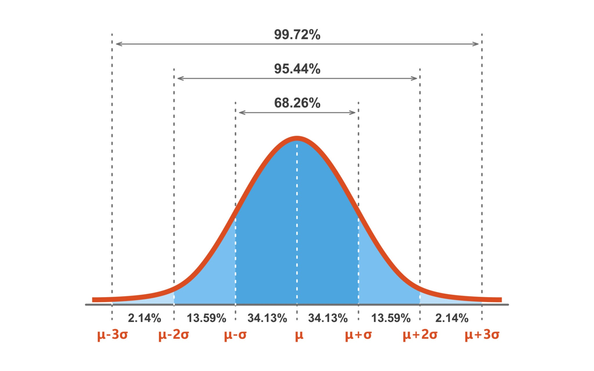
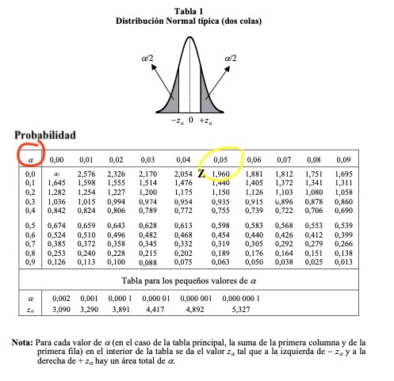

    
```{r setup, include=FALSE}
knitr::opts_chunk$set(echo = TRUE, warning = FALSE, message = FALSE)
```

# Introducción

Este documento proporciona ejemplos de cómo trabajar con el concepto frecuentista de probabilidad, las distribuciones de probabilidad más utilizadas y las funciones asociadas en R. Se explorarán las distribuciones **Normal**, **Binomial** y de **Poisson**, incluyendo ejemplos de sus funciones de densidad, distribución acumulativa, cálculo de percentiles y la generación de números aleatorios.

# Concepto Frecuentista de Probabilidad
    
La probabilidad es una medida numérica de la posibilidad de que ocurra un evento. Se denota como $P(A)$, donde A es el evento. La probabilidad se expresa como un número entre 0 y 1, donde 0 indica imposibilidad y 1 indica certeza.

El enfoque **frecuentista** define la probabilidad de un evento como el límite de su frecuencia relativa cuando el número de ensayos tiende a infinito.

### Regla de Laplace

Si todos los resultados posibles de un experimento son igualmente probables, la probabilidad de un evento A se calcula como:
$$P(A) = \frac{\text{número de casos favorables}}{\text{número de casos posibles}}$$
    
Veamos algunos ejemplos con el lanzamiento de un dado de 6 caras:
    
```{r}
# Probabilidad de obtener un 3
P_3 <- 1/6
print(paste("P(obtener un 3):", round(P_3, 3)))

# Probabilidad de obtener un número par
P_par <- 3/6
print(paste("P(obtener un número par):", round(P_par, 3)))

# Probabilidad de obtener un número mayor que 4
P_mayor_4 <- 2/6
print(paste("P(obtener un número > 4):", round(P_mayor_4, 3)))
```

### La Ley del Azar (Ley de los Grandes Números)

Si un experimento se repite un gran número de veces, la frecuencia relativa con la que ocurre un evento A se aproxima a su probabilidad teórica.

$$P(A) = \lim_{n \to \infty} \frac{\text{número de veces que ocurre A}}{n}$$

    
Simulemos lanzamientos de un dado para observar cómo la frecuencia relativa de obtener un "3" se acerca a la probabilidad teórica de $1/6 \approx 0.167$. Puedes probar cambiando el valor de `n` a 100, 1000, o 10000.

```{r}
# Simular los lanzamientos
n <- 10000 # número de lanzamientos
lanzamientos <- sample(1:6, n, replace = TRUE) # lanzar el dado n veces

# Calcular la frecuencia relativa
frecuencia_relativa_3 <- sum(lanzamientos == 3) / n
print(paste("Frecuencia relativa de obtener un 3 en", n, "lanzamientos:", frecuencia_relativa_3))

# Visualizar los resultados
hist(lanzamientos, 
     breaks = seq(0.5, 6.5, by = 1), 
     main = "Frecuencia de resultados al lanzar un dado", 
     xlab = "Número en el dado", 
     ylab = "Frecuencia", 
     col = "lightblue",
     freq = FALSE) # Usamos freq=FALSE para mostrar densidad (frec. relativa)
abline(h = 1/6, col = "red", lwd = 2)
legend("topright", legend = "Probabilidad Teórica (1/6)", col = "red", lty = 1, lwd = 2)
```

Probemos con diferentes valores de `n` para ver cómo la frecuencia relativa se acerca a la probabilidad teórica a medida que `n` aumenta.

```{r}
# 1. Configurar el panel de gráficos (3 filas, 2 columnas)
#    y ajustar los márgenes para que todo encaje bien
par(mfrow = c(3, 2), mar = c(4, 4, 3, 2))

# Vector con los diferentes valores de n que queremos probar
valores_n <- c(10, 100, 1000, 10000, 100000)
# Data frame para guardar los resultados
resultados <- data.frame(n = integer(), frecuencia_relativa = double())

# Probabilidad teórica
prob_teorica <- 1/6

# 2. Bucle for que itera sobre cada valor de n
for (n in valores_n) {
  
  # Simular los lanzamientos
  lanzamientos <- sample(1:6, n, replace = TRUE)
  
  # Calcular y guardar la frecuencia relativa
  frecuencia_relativa_3 <- sum(lanzamientos == 3) / n
  resultados <- rbind(resultados, data.frame(n = n, frecuencia_relativa = frecuencia_relativa_3))
  
  # Visualizar el histograma para esta n
  hist(lanzamientos,
       breaks = seq(0.5, 6.5, by = 1),
       main = paste("Frecuencia de resultados con n =", n),
       xlab = "Número en el dado",
       ylab = "Densidad",
       col = "lightblue",
       freq = FALSE)
  
  # Añadir la línea de la probabilidad teórica
  abline(h = prob_teorica, col = "red", lwd = 2)
  legend("topright", legend = "Prob. Teórica (1/6)", col = "red", lty = 1, lwd = 2, bty = "n", cex = 0.8)
}

# 3. Resetear la configuración del panel a la original (1x1)
par(mfrow = c(1, 1))
```

En la tabla siguiente se muestran los resultados de la frecuencia relativa de obtener un "3" para cada valor de `n`, junto con la diferencia absoluta respecto a la probabilidad teórica.

```{r}
options(scipen = 999) # Evitar notación científica en los números
# Mostrar los resultados en una tabla
# Añadimos la diferencia con la probabilidad teórica
resultados$diferencia <- abs(resultados$frecuencia_relativa - prob_teorica)
# Imprimimos la tabla
knitr::kable(
  resultados,
  digits = 5,
  col.names = c("Nº de Lanzamientos", "Frecuencia Relativa de '3'", "Diferencia Absoluta"),
  caption = "Convergencia de la Frecuencia Relativa a la Probabilidad Teórica"
)
```

### Definición Axiomática de Probabilidad (Kolmogorov)

Andrey Kolmogorov estableció una base matemática sólida para la probabilidad con tres axiomas:
    
1.  $P(A) \ge 0$ para todo evento A.
2.  $P(S) = 1$, donde S es el espacio muestral (el conjunto de todos los resultados posibles).
3.  Si $A_1, A_2, ...$ son eventos mutuamente excluyentes (no pueden ocurrir al mismo tiempo), entonces $P(A_1 \cup A_2 \cup ...) = P(A_1) + P(A_2) + ...$
    
**Ejemplo**: Al lanzar un dado, ¿cuál es la probabilidad de obtener un número par o un 3?
Usamos la regla de la adición: $P(\text{par} \cup 3) = P(\text{par}) + P(3)$. Como son mutuamente excluyentes, la intersección es cero.

```{r}
P_par_o_3 <- P_par + P_3
print(paste("P(par o 3):", P_par_o_3))
```

### Probabilidad Condicional

Cuando los eventos no son equiprobables o dependen de otro, usamos la probabilidad condicional, que calcula la probabilidad de un evento A dado que ha ocurrido un evento B.

$$P(A|B) = \frac{P(A \cap B)}{P(B)}$$

**Ejemplo**: En una baraja de 52 cartas, ¿cuál es la probabilidad de sacar un as (A) dado que ya se ha sacado una carta roja (R)?
```{r prob_condicional}
P_A <- 4/52 # Probabilidad de sacar un as
P_R <- 26/52 # Probabilidad de sacar una carta roja
P_AyR <- 2/52 # Probabilidad de sacar un as rojo (2 ases rojos en la baraja)
P_A_given_R <- P_AyR / P_R
print(paste("P(A|R):", round(P_A_given_R, 3)))
```

## Teorema de la probabilidad total y Bayes
### Teorema de la Probabilidad Total
Si $B_1, B_2, ..., B_n$ son eventos mutuamente excluyentes que cubren todo el espacio muestral (es decir, $B_1 \cup B_2 \cup ... \cup B_n = S$), entonces para cualquier evento A:

$$P(A) = \sum_{i=1}^{n} P(A|B_i) \cdot P(B_i)$$
**Ejemplo**: En una fábrica, el 60% de los productos provienen de la línea 1 ($P(L1) = 0.6$) y el 40% de la línea 2 ($P(L2) = 0.4$). La probabilidad de que un producto sea defectuoso es del 3% en la línea 1 ($P(D|L1) = 0.03$) y del 5% en la línea 2 ($P(D|L2) = 0.05$). 

¿Cuál es la probabilidad total de que un producto sea defectuoso ($P(D)$)?
Solución:   

```{r teorema_prob_total}
P_L1 <- 0.6
P_L2 <- 0.4
P_D_given_L1 <- 0.03
P_D_given_L2 <- 0.05
P_D <- (P_D_given_L1 * P_L1) + (P_D_given_L2 * P_L2)
print(paste("P(D):", round(P_D, 4)))
```

### Teorema de Bayes
Permite actualizar la probabilidad de un evento A dado que ha ocurrido un evento B, utilizando la probabilidad condicional y el teorema de la probabilidad total. Es útil cuando se conoce $P(B|A)$ pero se desea encontrar $P(A|B)$. La información de la que se dispone "prior" se actualiza con la nueva evidencia. Formalmente, se expresa como:

$$P(A|B) = \frac{P(B|A) \cdot P(A)}{P(B)}$$

**Ejemplo**: En una prueba médica, la probabilidad de que una persona tenga una enfermedad (D) es del 1% ($P(D) = 0.01$). La prueba es 99% precisa para detectar la enfermedad si la persona la tiene ($P(Positivo|D) = 0.99$) y 95% precisa para dar negativo si la persona no la tiene $P(Negativo|No D) = 0.95$. Si una persona da positivo en la prueba, ¿cuál es la probabilidad de que realmente tenga la enfermedad ($P(D|Positivo)$)?    

Por la ley de la probabilidad total 

$$P(Positivo) = P(Positivo|D) \cdot P(D) + P(Positivo|NoD) \cdot P(NoD)$$, donde $P(NoD) = 1 - P(D)$ y $P(Positivo|NoD) = 1 - P(Negativo|NoD)$.  

Aplicando la fórmula de Bayes, tenemos que la probabilidad buscada es:  $P(D|Positivo)$ es:   

$$P(D|Positivo)=\frac{P(Positivo|D) \cdot P(D)}{P(Positivo)}$$

$$P(D|Positivo)= \frac{P(Positivo|D) \cdot P(D)}{P(Positivo|D) \cdot P(D) + P(Positivo|NoD) \cdot P(NoD)}$$
Solución en R:

```{r}
P_D <- 0.01 # Probabilidad de tener la enfermedad
P_NoD <- 0.99 # Probabilidad de no tener la enfermedad
P_Positivo_given_D <- 0.99 # Probabilidad de positivo dado que tiene la enfermedad
P_Positivo_given_NoD <- 0.05 # Probabilidad de positivo dado que no tiene la enfermedad
P_Positivo <- (P_Positivo_given_D * P_D) + (P_Positivo_given_NoD * P_NoD) # Ley de la probabilidad total
P_D_given_Positivo <- (P_Positivo_given_D * P_D) / P_Positivo
print(paste("P(D|Positivo):", round(P_D_given_Positivo, 4)))
```

# Variable Aleatoria y Cálculo de Probabilidades

Una **variable aleatoria** (VA) es una función que asigna un valor numérico a cada resultado de un experimento aleatorio. Puede ser **discreta** (toma valores específicos) o **continua** (toma cualquier valor dentro de un intervalo). Su comportamiento se describe mediante **funciones de probabilidad**. Las funciones de probabilidad para la VA discreta son:  
1. Función de Masa de Probabilidad (f.m.p.)  
2. Función de Distribución Acumulativa (f.d.a.)  
Para la VA continua son:  
1. Función de Densidad de Probabilidad (f.d.p.)  
2. Función de Distribución Acumulativa (f.d.a.)  

## Las Funciones de Probabilidad de las variables aleatorias
Estas funciones describen la distribución de probabilidad de una variable aleatoria, ya sea discreta o continua. Pueden ser funciones de masa de probabilidad (f.m.p.) para variables discretas o funciones de densidad de probabilidad (f.d.p.) para variables continuas. Además tenemos la función de distribución acumulativa (f.d.a.) que es aplicable a ambos tipos de variables. Estas funciones permiten calcular probabilidades, percentiles y generar números aleatorios. Una función en matemáticas es una relación entre un conjunto dado de entradas y un conjunto dado de salidas con la propiedad de que cada entrada está relacionada con exactamente una salida.   

Por ejemplo la función cuadrática $f(x) = x^2$ asigna a cada número real $x$ su cuadrado, y se representa en graficamente en el plano cartesiano como una parábola. Vease la siguiente figura en R:  

```{r}
# Definir la función cuadrática
f <- function(x) {
  return(x^2)
}
# Generar valores de x
x <- seq(-10, 10, by = 0.1)
# Calcular los valores de f(x)
y <- f(x)
# Graficar la función
plot(x, y, type = "l", col = "blue", lwd = 2,
     main = "Función Cuadrática f(x) = x^2",
     xlab = "x", ylab = "f(x)")
abline(h = 0, col = "black", lty = 2) # Línea horizontal en y=0
abline(v = 0, col = "black", lty = 2) # Línea vertical en x=0
```

Por lo tanto las f.d.p representan la relación entre los valores de la variable aleatoria y sus probabilidades asociadas. Graficamente se representa como una curva (para variables continuas) o barras (para variables discretas) en un gráfico de probabilidad.  

## Variable Aleatoria Discreta
La VA discreta toma un número finito o contable de valores.  

**Ejemplo**: Variable aleatoria $X$ es el número de caras al lanzar 3 monedas al aire.

Simulación del experimento aleatorio en R:
```{r var_discreta}
n_monedas <- 3
# Simulamos el lanzamiento (0 = cruz, 1 = cara)
lanzamientos_monedas <- sample(c(0, 1), n_monedas, replace = TRUE)
# La variable aleatoria X es el número total de caras
X_discreta <- sum(lanzamientos_monedas)
print(paste("Número de caras obtenidas:", X_discreta))
```

### Función de Masa de Probabilidad (f.m.p.) - Para variables discretas
Describe la probabilidad de que una variable aleatoria discreta tome un valor específico, $P(X=x)$. La f.m.p se denota como: 
$$P(X = x) = \text{f(x)},$$
y cumple las siguientes propiedades:

1. $P(X = x) >= 0$ para todo x  
2. La suma de $P(X = x)$ sobre todos los valores posibles de x es igual a 1  

**Ejemplo**: La f.m.p. de una distribución Binomial para el lanzamiento de 3 monedas
se representa graficamente como barras en un gráfico de probabilidad. Vease la siguiente figura:

```{r}
n_monedas <- 3 # Lanzamiento de tres monedas al aire
# P(X=k) para k=0, 1, 2, 3 caras
x_discreta = 0:n_monedas # valores posibles de X
P_X = dbinom(x_discreta, size = n_monedas, prob = 0.5) # f.m.p. de la binomial
barplot(P_X, names.arg = x_discreta, 
        main = "Función de masa de probabilidad de la binomial", 
        xlab = "x", ylab = "P(X = x)", col = "lightgreen")
```

### Expectación de una Variable Aleatoria Discreta
La expectación (valor esperado) de una variable aleatoria discreta se calcula con la siguiente fórmula:

$$E(X) = \sum_{i} x_i \cdot P(X = x_i)$$

donde $x_i$ son los valores posibles de la variable aleatoria y $P(X = x_i)$ es la probabilidad de que la variable tome el valor $x_i$.

En el ejemplo anterior (lanzar tres monedas al aire dónde la variable aletaria $$X$$ = "Número de caras") construimos esta tabla y tenemos:  


| Valor de X (x_i) | Probabilidad P(X = x_i) |
|------------------|-------------------------|
|        0         |          1/8            |
|        1         |          3/8            |
|        2         |          3/8            |
|        3         |          1/8            |


Por lo tanto la expectación E(X) se calcula como:

$$E(X) = 0 \cdot \frac{1}{8} + 1 \cdot \frac{3}{8} + 2 \cdot \frac{3}{8} + 3 \cdot \frac{1}{8} = \frac{12}{8} = 1.5$$
Esta expectación matemática la calculamos en R como sigue:

```{r expectacion_discreta}
# Valores posibles de X (0, 1, 2, 3 caras)
x_valores <- 0:n_monedas
# Probabilidades de cada valor (f.m.p. de la binomial)
P_X <- dbinom(x_valores, size = n_monedas, prob = 0.5)
# Cálculo de la expectación
expectacion_X <- sum(x_valores * P_X)
print(paste("Expectación E(X):", expectacion_X))
```

## Variable Aleatoria Continua
Toma un número infinito de valores dentro de un intervalo.  Representa magnitudes que pueden medirse con precisión decimal. En las ciencias de la salud estan representadas por multitud de marcadores biológicos como por ejemplo glucosa o colesterol en mg/dl en plasma. Otro ejemplo más sencill es el peso o la altura de una persona.

**Ejemplo**: La altura de una persona en metros.  

```{r}
# Generamos una altura aleatoria de una distribución normal con media 170 y sd 10
altura_persona <- rnorm(1, mean = 170, sd = 10)
print(paste("Altura generada:", round(altura_persona, 2), "cm"))
```

### Función de Densidad de Probabilidad (f.d.p.) - Para variables continuas
Es una función que describe la probabilidad relativa de que una variable aleatoria continua tome un valor específico.

La f.d.p. se denota como f(x) y cumple las siguientes propiedades:  

1. f(x) >= 0 para todo x  
2. La integral de f(x) sobre todo el espacio es igual a 1  
3. La probabilidad de que X esté en un intervalo [a, b] se calcula como la probabilidad $P(a \le X \le b)$ y es el área bajo la curva entre $a$ y $b$:   

$$P(a \le X \le b) = \int_{a}^{b} f(x) dx$$ 

Nota:lE área bajo la curva en un punto es cero. Por ejemplo, la probabilidad de que una persona mida exactamente 170 cm es 0, pero la probabilidad de que mida entre 160 cm y 180 cm puede ser scalculada. Esta proababiliad entreos valores se calcula como el área bajo la curva de la f.d.p. entre esos dos valores. Graficamente esto se representa como el área bajo la curva de la f.d.p. entre los límites a y b. Vease la siguiente figura:  

**Ejemplo**: La f.d.p. de una distribución Normal con media 170 y desviación estándar 10. 
```{r}
# Generar valores de x
x_continua <- seq(120, 220, by = 1)
# Calcular la f.d.p. de la normal estándar
f_X <- dnorm(x_continua, mean = 170, sd = 10)
# Graficar la f.d.p.
plot(x_continua, f_X, type = "l", col = "blue", lwd = 2,
     main = "Función de densidad de probabilidad de la Normal Estándar",
     xlab = "x", ylab = "f(x)")
abline(h = 0, col = "black", lty = 2) # Línea horizontal en y=0
abline(v = 0, col = "black", lty = 2) # Línea vertical en x=0
# Sombrear el área enrtre 120 y 195
# Sombrear el área entre -1 y 1
x_fill <- seq(160, 180, by = 1)
y_fill <- dnorm(x_fill, mean = 170, sd = 10)
polygon(c(x_fill, rev(x_fill)), c(y_fill, rep(0, length(y_fill))), col = rgb(0, 0, 1, 0.3), border = NA)
legend("topright", legend = "Área entre 160 y 180", fill = rgb(0, 0, 1, 0.3), bty = "n")
```

### Expectación de una Variable Aleatoria Continua
La expectacion de la VA continua se cálcula con la siguiente fórmula:

$$E(X) = \int_{-\infty}^{\infty} x \cdot f(x) \, dx$$
donde $f(x)$ es la función de densidad de probabilidad de la variable aleatoria X, y $x$ es el valor de la variable aleatoria.

Por ejemplo en una distribución normal $N(\mu, \sigma^2)$, la expectación es igual a la media $\mu$. La expectación en R de la VA continua (simulación) en R:

```{r expectacion_continua}
# Simulamos 10000 alturas de una distribución normal
set.seed(123) # Para reproducibilidad
alturas <- rnorm(10000, mean = 170, sd = 10)
# Cálculo de la expectación (media muestral)
expectacion_alturas <- mean(alturas)
print(paste("Expectación E(X) de alturas:", round(expectacion_alturas, 2), "cm"))
```

# Función de Distribución Acumulativa (f.d.a.) - Para variables discretas y continuas
La f.d.a. describe la probabilidad de que una variable aleatoria tome un valor menor o igual a un valor específico, $P(X \le x)$. Se denota como F(x) y cumple las siguientes propiedades:  

1. F(x) es una función no decreciente  
2. $\lim_{x \to -\infty} F(x) = 0$ y $\lim_{x \to \infty} F(x) = 1$  
3. La probabilidad de que X esté en un intervalo [a, b] se calcula como:  
$$P(a \le X \le b) = F(b) - F(a)$$  

**Ejemplo**: La f.d.a. de una distribución Binomial para el lanzamiento de 3 monedas al aire.

```{r}
n_monedas <- 3
# P(X<=k) para k=0, 1, 2, 3 caras
x_discreta = 0:n_monedas # valores posibles de X
F_X = pbinom(x_discreta, size = n_monedas, prob = 0.5) # f.d.a. de la binomial
barplot(F_X, names.arg = x_discreta, 
        main = "Función de distribución acumulativa de la binomial", 
        xlab = "x", ylab = "F(X)", col = "lightcoral", ylim = c(0,1))
abline(h = 0, col = "black", lty = 2) # Línea horizontal en y=0
abline(h = 1, col = "black", lty = 2) # Línea horizontal en y=1
abline(v = 0, col = "black", lty = 2) # Línea vertical en x=0
legend("topleft", legend = "F(X)", fill = "lightcoral", bty = "n")
```

**Ejemplo**: La f.d.a. de una distribución Normal con media 0 y desviación estándar 1.
```{r}
# Generar valores de x
x_continua <- seq(-4, 4, by = 0.1)
# Calcular la f.d.a. de la normal estándar
F_X <- pnorm(x_continua, mean = 0, sd = 1)
# Graficar la f.d.a.
plot(x_continua, F_X, type = "l", col = "green", lwd = 2,
     main = "Función de distribución acumulativa de la Normal Estándar",
     xlab = "x", ylab = "F(x)")
abline(h = 0, col = "black", lty = 2) # Línea horizontal en y=0
abline(h = 1, col = "black", lty = 2) # Línea horizontal en y=1
abline(v = 0, col = "black", lty = 2) # Línea vertical en x=0
legend("topleft", legend = "F(x)", col = "green", lty = 1, lwd = 2, bty = "n")
```

# Distribuciones de probablidad más comunes en R
Las distribuciones de probabilidad son fundamentales en estadística y análisis de datos. A continuación, se presentan las distribuciones más comunes junto con sus funciones asociadas en R.

## Distribución Normal
La distribución Normal, también conocida como distribución Gaussiana, es una de las distribuciones más importantes en estadística. Se caracteriza por su forma de campana y está definida por dos parámetros: la media ($\mu$) y la desviación estándar ($\sigma$). La fórmula de la f.d.p para la distribución normal es 

$$f(x) = \frac{1}{\sigma \sqrt{2\pi}} e^{-\frac{(x - \mu)^2}{2\sigma^2}}$$
donde $e$ es la base del logaritmo natural (aproximadamente 2.71828), $\pi$ es la constante pi (aproximadamente 3.14159) y $x$ es la densidad de probabilidad en el punto x de la variable aleatoria. 

Genericamente la distribución normal se denota como $N(\mu, \sigma^2)$, donde $\mu$ es la media y $\sigma^2$ es la varianza (el cuadrado de la desviación estándar) y se prueba:

{width="100%"}
La f.d.p y f.d.a. de la distribución normal con media 0 y desviación estándar 1 es representada en las siguientes figuras:

```{r f.d.p_normal}
# f.d.p.
mu <- 0      # Media
sigma <- 1   # Desviación estándar
# Valores para x
x <- seq(-4, 4, by = 0.1)
# Calcular la f.d.p. de la normal estándar
f_dp <- dnorm(x, mean = 0, sd = 1)
# Graficar f.d.p.
plot(x, f_dp, type = "l", col = "blue", lwd = 2,
     main = "Función de Densidad de Probabilidad de la Normal",
     xlab = "x", ylab = "f(x)")
abline(h = 0, col = "black", lty = 2)
abline(v = mu, col = "red", lty = 2) # Línea en la media
legend("topright", legend = c("f.d.p.", "Media (μ)"), col = c("blue", "red"), lty = 1:2, lwd = 2, bty = "n")
```

```{r}
# f.d.a.
F_da <- pnorm(x, mean = mu, sd = sigma)
# Graficar f.d.a.
plot(x, F_da, type = "l", col = "green", lwd = 2,
     main = "Función de Distribución Acumulativa de la Normal",
     xlab = "x", ylab = "F(x)")
abline(h = 0, col = "black", lty = 2)
abline(h = 1, col = "black", lty = 2)
abline(v = mu, col = "red", lty = 2) # Línea en la media
legend("topleft", legend = c("f.d.a.", "Media (μ)"), col = c("green", "red"), lty = 1:2, lwd = 2, bty = "n")
```

### La tipificacion de la distribución normal
Cualquier variable aleatoria que siga una distribución normal $N(\mu, \sigma^2)$ puede ser transformada en una variable aleatoria que siga una distribución normal estándar $N(0, 1)$ mediante la siguiente fórmula de tipificación:
$$Z = \frac{X - \mu}{\sigma}$$
donde $Z$ es la variable aleatoria tipificada, $X$ es la variable aleatoria original, $\mu$ es la media y $\sigma$ es la desviación estándar. Esta transformación permite comparar diferentes distribuciones normales y calcular probabilidades utilizando tablas de la distribución normal estándar. 

Notese que el uso de las tablas de la distribución normal estándar es una herramienta útil para calcular probabilidades y percentiles sin necesidad de realizar cálculos complejos. Pero actualmente estas probabilidades y percentiles se calculan mucho más facilemente con R. 

{width="100%"}
Los percentiles de la distribución normal indican el valor por debajo del cual se encuentra un cierto porcentaje de la población. Por ejemplo, el percentil 95 es el valor por debajo del cual se encuentra el 95% de los datos. En una distribución normal estándar, el percentil 95 es aproximadamente 1.645. El 97.5 es aproximadamente 1.96 y el 99 es aproximadamente 2.33.

Graficamente se representa como el área bajo la curva de la f.d.p. hasta el valor del percentil 97,5 que se corresponde con un $Z_{\frac{\alpha}{2}}$. Vease la siguiente figura realizada con código en R:

```{r}
# 1. Configurar el diseño de la gráfica para dos paneles
par(mfrow = c(1, 2))

# 2. Panel Izquierdo: Percentil 2.5
# ------------------------------------

# Generar valores de x
x_continua <- seq(-4, 4, by = 0.01)
# Calcular la f.d.p. de la normal estándar
f_X <- dnorm(x_continua, mean = 0, sd = 1)
# Graficar la f.d.p.
plot(x_continua, f_X, type = "l", col = "blue", lwd = 2,
     main = "Percentil 2.5",
     xlab = "Valor de z", ylab = "f(z)")
abline(h = 0, col = "gray", lty = 2)
abline(v = 0, col = "gray", lty = 2)

# Calcular el valor de z para el percentil 2.5
z_2.5 <- qnorm(0.025)

# Añadir la línea vertical y sombrear el área
abline(v = z_2.5, col = "red", lty = 2, lwd = 2)
text(z_2.5, max(f_X) * 0.9, labels = paste("z =", round(z_2.5, 2)), pos = 2, col = "red")

# Sombrear el área hasta el percentil 2.5
x_fill <- seq(-4, z_2.5, by = 0.01)
y_fill <- dnorm(x_fill, mean = 0, sd = 1)
polygon(c(x_fill, rev(x_fill)), c(y_fill, rep(0, length(y_fill))), col = rgb(1, 0, 0, 0.2), border = NA)

# 3. Panel Derecho: Percentil 97.5
# ------------------------------------

# La f.d.p. es la misma
plot(x_continua, f_X, type = "l", col = "blue", lwd = 2,
     main = "Percentil 97.5",
     xlab = "Valor de z", ylab = "f(z)")
abline(h = 0, col = "gray", lty = 2)
abline(v = 0, col = "gray", lty = 2)

# Calcular el valor de z para el percentil 97.5
z_97.5 <- qnorm(0.975)

# Añadir la línea vertical y sombrear el área
abline(v = z_97.5, col = "green", lty = 2, lwd = 2)
text(z_97.5, max(f_X) * 0.9, labels = paste("z =", round(z_97.5, 2)), pos = 4, col = "green")

# Sombrear el área hasta el percentil 97.5
x_fill_97.5 <- seq(-4, z_97.5, by = 0.01)
y_fill_97.5 <- dnorm(x_fill_97.5, mean = 0, sd = 1)
polygon(c(x_fill_97.5, rev(x_fill_97.5)), c(y_fill_97.5, rep(0, length(y_fill_97.5))), col = rgb(0, 1, 0, 0.2), border = NA)

# 4. Restablecer la configuración de la gráfica a 1 panel
par(mfrow = c(1, 1))
```

El percentil 97.5 con media 0 y desviación estándar 1 se cálcula en R como sigue:

```{r}
# Percentil 97.5 referido al Z_alfa/2 y por lo tanto al intervalo de confianza del 95% que ya veremos en la sección de inferencia estadística
percentil_97.5 <- qnorm(0.975, mean = mu, sd = sigma)
print(paste("Percentil 97.5 de la Normal tipificada:", round(percentil_97.5, 2)))
```

También podemos generar números aleatorios de una distribución normal con media 0 y desviación estándar 1 con la función `rnorm` como sigue: 

```{r}
# Generar 10 números aleatorios
set.seed(123) # Para reproducibilidad
random_numbers <- rnorm(10, mean = mu, sd = sigma)
print("Números aleatorios generados de la Normal:")
print(round(random_numbers, 2))
```

A continuación mostramos como calcular la probabilidad de una variable aleatoria normal estándar sea menor o igual a 1.5 y la probabilidad de que esté entre -1 y 1. Para lo cual usamos la función `pnorm` que nos proporciona la p.f.a P(X <= x).

```{r}
# P(X <= 1.5)
P_menor_1_5 <- pnorm(1.5, mean = mu, sd = sigma)
print(paste("P(X <= 1.5):", round(P_menor_1_5, 4)))
# P(-1 <= X <= 1)
P_entre_menos1_y_1 <- pnorm(1, mean = mu, sd = sigma) - pnorm(-1, mean = mu, sd = sigma)
print(paste("P(-1 <= X <= 1):", round(P_entre_menos1_y_1, 4)))
# P(X > 2)
P_mayor_2 <- 1 - pnorm(2, mean = mu, sd = sigma)
print(paste("P(X > 2):", round(P_mayor_2, 4)))
# Tambien se puede usar 
P_mayor_2_alt <- pnorm(2, mean = mu, sd = sigma, lower.tail = FALSE)
print(paste("P(X > 2) (método alternativo):", round(P_mayor_2_alt, 4)))
```

## Distribución Binomial
La distribución Binomial modela el número de éxitos en una secuencia de n ensayos independientes, cada uno con una probabilidad fija de éxito p. Su f.m.p. está dada por:
$$P(X = k) = \binom{n}{k} p^k (1-p)^{n-k}$$
donde $\binom{n}{k}$ es el coeficiente binomial que representa el número de formas de elegir k éxitos en n ensayos, $p$ es la probabilidad de éxito en cada ensayo, y $(1-p)$ es la probabilidad de fracaso. 
La expectación (valor esperado) y la varianza de una distribución binomial son:  

- Expectación: $E(X) = n \cdot p$  
- Varianza: $Var(X) = n \cdot p \cdot (1-p)$  

Ejemplo de una distribución Binomial con n=10 y p=0.5.  La E(X) es 5 y la Var(X) es 2.5.

### Funciones Asociadas
- **Función de Masa de Probabilidad (f.m.p.)**: `dbinom(x, size = n, prob = p)`
- **Función de Distribución Acumulativa (f.d.a.)**: `pbinom(q, size = n, prob = p)`
- **Función Cuantil (Percentil)**: `qbinom(p, size = n, prob = p)`
- **Generación de Números Aleatorios**: `rbinom(n, size = n, prob = p)`

### Ejemplos en R
Parametros de la distribución binomial
```{r}
# Parámetros de la distribución binomial
n <- 10  # Número de ensayos
p <- 0.5 # Probabilidad de éxito
# Valores para x
x <- 0:n
```

La f.m.p y f.d.a. de la distribución Binomial con n=10 y p=0.5, junto con el cálculo del percentil 90 y la generación de 10 números aleatorios.

```{r}
# f.m.p.
f_mp <- dbinom(x, size = n, prob = p)
# Graficar f.m.p.
barplot(f_mp, names.arg = x, col = "lightblue",
        main = "Función de Masa de Probabilidad de la Binomial",
        xlab = "Número de Éxitos (x)", ylab = "P(X = x)")
```

```{r}
# f.d.a.
F_da <- pbinom(x, size = n, prob = p)
# Graficar f.d.a.
plot(x, F_da, type = "s", col = "orange", lwd = 2,
     main = "Función de Distribución Acumulativa de la Binomial",
     xlab = "Número de Éxitos (x)", ylab = "F(x)")
abline(h = 0, col = "black", lty = 2)
abline(h = 1, col = "black", lty = 2)
legend("topleft", legend = "f.d.a.", col = "orange", lty = 1, lwd = 2, bty = "n")
```

```{r}
# Percentil 90
percentil_90 <- qbinom(0.9, size = n, prob = p)
print(paste("Percentil 90 de la Binomial:", percentil_90))
```

```{r}
# Generar 10 números aleatorios
set.seed(123) # Para reproducibilidad
random_numbers <- rbinom(10, size = n, prob = p)
print("Números aleatorios generados de la Binomial:")
print(random_numbers)
```

El cálculo de probabilidades utilizando las funciones de probabilidad es fundamental en estadística y análisis de datos. A continuación, se presentan ejemplos de cómo calcular probabilidades específicas utilizando las funciones de masa de probabilidad (f.m.p.) para variables discretas y funciones de densidad de probabilidad (f.d.p.) para variables continuas en R (**Lo vemos con más detalle en prácticas**).

P(X = 5)
```{r}
# P(X = 5)
P_X_5 <- dbinom(5, size = n, prob = p)
print(paste("P(X = 5):", round(P_X_5, 4)))
```

P(X <= 3)
```{r}
# P(X <= 3)
P_X_menor_igual_3 <- pbinom(3, size = n, prob = p)
print(paste("P(X <= 3):", round(P_X_menor_igual_3, 4)))
```

P(X < 4)
```{r}
# P(X < 4) ojo que es lo mismo que P(X <= 3) 
P_X_menor_4 <- pbinom(3, size = n, prob = p) # Igual que P(X <= 3)
print(paste("P(X < 4):", round(P_X_menor_4, 4)))
```

Graficamente P(X < 4)
```{r}
# Graficar f.m.p. con P(X < 4) sombreado
# Este script demuestra cómo representar gráficamente la probabilidad P(X < 4)
# para una variable aleatoria discreta X (en este caso, una Binomial).
# Instalar y cargar el paquete 'ggplot2' si es necesario
# install.packages("ggplot2")
library(ggplot2)
library(dplyr) # Para manipulación de datos
# --- 1. Definición de la Variable Aleatoria Discreta (Binomial) ---
# Parámetros Binomiales
n <- 10 # Número de ensayos (size)
p <- 0.5 # Probabilidad de éxito (prob)
# Rango de valores de X a graficar (de 0 a n)
x_values <- 0:n 
# Calcular la Función de Masa de Probabilidad (f.m.p.)
# dbinom(x, size, prob) da P(X = x)
pmf_values <- dbinom(x_values, size = n, prob = p)
# Crear un data frame para graficar
datos_pmf <- data.frame(
  X = x_values,
  PMF = pmf_values
)
# --- 2. Definir el Intervalo de Interés ---
# El interés es P(X < 4). Como X es discreta, esto es P(X=0) + P(X=1) + P(X=2) + P(X=3).
limite_inferior <- 0 
limite_superior <- 3 # P(X < 4) es P(X <= 3)
# Marcar las barras que cumplen la condición para resaltarlas en el gráfico
datos_pmf <- datos_pmf %>%
  mutate(
    es_probabilidad = X >= limite_inferior & X <= limite_superior,
    color_barra = ifelse(es_probabilidad, "Probabilidad", "Otros Valores")
  )
# --- 3. Calcular la Probabilidad Total ---
# P(X < 4) = P(X <= 3)
# Usamos pbinom() para calcular P(X <= 3)
prob_total <- pbinom(limite_superior, size = n, prob = p) 
# También se puede calcular sumando las probabilidades individuales:
# prob_total_check <- sum(dbinom(0:3, size = n, prob = p))
# --- 4. Generar el Gráfico de Barras (f.m.p.) ---
etiqueta_prob <- paste0("P(X < 4) = P(X=0, 1, 2, 3) \nProbabilidad = ", round(prob_total, 4))
grafico_pmf <- ggplot(datos_pmf, aes(x = X, y = PMF)) +
  # Las barras representan la f.m.p.
  geom_bar(
    stat = "identity", 
    aes(fill = color_barra), 
    width = 0.7, 
    color = "black"
  ) +
  # Añadir texto en el área sombreada para mostrar el valor
  annotate(
    "text", 
    x = 1.5, # Nueva posición centrada en 0, 1, 2, 3
    y = max(datos_pmf$PMF) * 0.9, 
    label = etiqueta_prob, 
    size = 4, 
    color = "darkred", 
    fontface = "bold"
  ) +
  scale_fill_manual(
    values = c("Probabilidad" = "#26734d", "Otros Valores" = "#9EC9E2"), 
    name = "Región de Interés"
  ) +
  scale_x_continuous(breaks = x_values) + # Asegura que todos los valores de X se muestren en el eje
  labs(
    title = "Función de Masa de Probabilidad (Binomial n=10, p=0.5)",
    subtitle = "Área bajo la curva (barras) para P(X < 4)",
    x = "Número de Éxitos (X)",
    y = "Probabilidad P(X = x)"
  ) +
  theme_minimal() +
  theme(legend.position = "bottom")
print(grafico_pmf)
```

P(X > 7)
```{r}
# P(X > 7)
P_X_mayor_7 <- 1 - pbinom(7, size = n, prob = p) 
print(paste("P(X > 7):", round(P_X_mayor_7, 4)))
# Alternativamente
P_X_mayor_7_alt <- pbinom(7, size = n, prob = p, lower.tail = FALSE)
print(paste("P(X > 7) (método alternativo):", round(P_X_mayor_7_alt, 4)))
```

P(3 < X <= 7)
```{r}
# P(3 < X <= 7)
P_entre_3_y_7 <- pbinom(7, size = n, prob = p) - pbinom(3, size = n, prob = p)
print(paste("P(3 < X <= 7):", round(P_entre_3_y_7, 4)))
```

Graficamente P(3 < X <= 7)
```{r}
# Graficar f.m.p. con P(3 < X <= 7) sombreado
# Este script demuestra cómo representar gráficamente la probabilidad P(3 < X <= 7)
# para una variable aleatoria discreta X (en este caso, una Binomial).
# Instalar y cargar el paquete 'ggplot2' si es necesario
# install.packages("ggplot2")
library(ggplot2)
library(dplyr) # Para manipulación de datos
# --- 1. Definición de la Variable Aleatoria Discreta (Binomial) ---
# Parámetros Binomiales
n <- 10 # Número de ensayos (size)
p <- 0.5 # Probabilidad de éxito (prob)
# Rango de valores de X a graficar (de 0 a n)
x_values <- 0:n
# Calcular la Función de Masa de Probabilidad (f.m.p.)
# dbinom(x, size, prob) da P(X = x)
pmf_values <- dbinom(x_values, size = n, prob = p)
# Crear un data frame para graficar
datos_pmf <- data.frame(
  X = x_values,
  PMF = pmf_values
)
# --- 2. Definir el Intervalo de Interés ---
# El interés es P(3 < X <= 7). Como X es discreta, esto es P(X=4) + P(X=5) + P(X=6) + P(X=7).
limite_inferior <- 4
limite_superior <- 7 # P(3 < X <= 7) es P(X=4,5,6,7)
# Marcar las barras que cumplen la condición para resaltarlas en el gráfico
datos_pmf <- datos_pmf %>%
  mutate(
    es_probabilidad = X >= limite_inferior & X <= limite_superior,
    color_barra = ifelse(es_probabilidad, "Probabilidad", "Otros Valores")
  )
# --- 3. Calcular la Probabilidad Total ---
# P(3 < X <= 7) = P(X=4,5,6,7)
# Usamos pbinom() para calcular P(X <= 7) - P(X <= 3)
prob_total <- pbinom(limite_superior, size = n, prob = p) - pbinom(limite_inferior - 1, size = n, prob = p)
# También se puede calcular sumando las probabilidades individuales:
# prob_total_check <- sum(dbinom(4:7, size = n, prob = p))
# --- 4. Generar el Gráfico de Barras (f.m.p.) ---
etiqueta_prob <- paste0("P(3 < X <= 7) = P(X=4,5,6,7) \nProbabilidad = ", round(prob_total, 4))
grafico_pmf <- ggplot(datos_pmf, aes(x = X, y = PMF)) +
  # Las barras representan la f.m.p.
  geom_bar(
    stat = "identity", 
    aes(fill = color_barra), 
    width = 0.7, 
    color = "black"
  ) +
  # Añadir texto en el área sombreada para mostrar el valor
  annotate(
    "text", 
    x = 5.5, # Nueva posición centrada en 4, 5, 6, 7
    y = max(datos_pmf$PMF) * 0.9, 
    label = etiqueta_prob, 
    size = 4, 
    color = "darkred", 
    fontface = "bold"
  ) +
  scale_fill_manual(
    values = c("Probabilidad" = "#26734d", "Otros Valores" = "#9EC9E2"), 
    name = "Región de Interés"
  ) +
  scale_x_continuous(breaks = x_values) + # Asegura que todos los valores de X se muestren en el eje
  labs(
    title = "Función de Masa de Probabilidad (Binomial n=10, p=0.5)",
    subtitle = "Área bajo la curva (barras) para P(3 < X <= 7)",
    x = "Número de Éxitos (X)",
    y = "Probabilidad P(X = x)"
  ) +
  theme_minimal() +
  theme(legend.position = "bottom")
print(grafico_pmf)
```

P(3 <= X <= 7)
```{r}
# P(3 <= X <= 7) ojo que es lo mismo que:
# P(3 < X <= 7) + P(X=3) o P(X <= 7) - P(X < 3) = P(X <= 7) - P(X <= 2)
P_entre_3_y_7_incl <- pbinom(7, size = n, prob = p) - pbinom(2, size = n, prob = p)
print(paste("P(3 <= X <= 7):", round(P_entre_3_y_7_incl, 4)))
```

Graficamente P(3 <= X <= 7)
```{r}
# Graficar f.m.p. con P(3 <= X <= 7) sombreado
# Este script demuestra cómo representar gráficamente la probabilidad P(3 <= X <= 7)
# para una variable aleatoria discreta X (en este caso, una Binomial).
# Instalar y cargar el paquete 'ggplot2' si es necesario
# install.packages("ggplot2")
library(ggplot2)
library(dplyr) # Para manipulación de datos
# --- 1. Definición de la Variable Aleatoria Discreta (Binomial) ---
# Parámetros Binomiales
n <- 10 # Número de ensayos (size)
p <- 0.5 # Probabilidad de éxito (prob)
# Rango de valores de X a graficar (de 0 a n)
x_values <- 0:n
# Calcular la Función de Masa de Probabilidad (f.m.p.)
# dbinom(x, size, prob) da P(X = x)
pmf_values <- dbinom(x_values, size = n, prob = p)
# Crear un data frame para graficar
datos_pmf <- data.frame(
  X = x_values,
  PMF = pmf_values
)
# --- 2. Definir el Intervalo de Interés ---
# El interés es P(3 <= X <= 7). Como X es discreta, esto es P(X=3) + P(X=4) + P(X=5) + P(X=6) + P(X=7).
limite_inferior <- 3
limite_superior <- 7 # P(3 <= X <= 7) es P(X=3,4,5,6,7)
# Marcar las barras que cumplen la condición para resaltarlas en el gráfico
datos_pmf <- datos_pmf %>%
  mutate(
    es_probabilidad = X >= limite_inferior & X <= limite_superior,
    color_barra = ifelse(es_probabilidad, "Probabilidad", "Otros Valores")
  )
# --- 3. Calcular la Probabilidad Total ---
# P(3 <= X <= 7) = P(X=3,4,5,6,7)
# Usamos pbinom() para calcular P(X <= 7) - P(X <= 2)
prob_total <- pbinom(limite_superior, size = n, prob = p) - pbinom(limite_inferior - 1, size = n, prob = p)
# También se puede calcular sumando las probabilidades individuales:
# prob_total_check <- sum(dbinom(3:7, size = n, prob = p))
# --- 4. Generar el Gráfico de Barras (f.m.p.) ---
etiqueta_prob <- paste0("P(3 <= X <= 7) = P(X=3,4,5,6,7) \nProbabilidad = ", round(prob_total, 4))
grafico_pmf <- ggplot(datos_pmf, aes(x = X, y = PMF)) +
  # Las barras representan la f.m.p.
  geom_bar(
    stat = "identity", 
    aes(fill = color_barra), 
    width = 0.7, 
    color = "black"
  ) +
  # Añadir texto en el área sombreada para mostrar el valor
  annotate(
    "text", 
    x = 5, # Nueva posición centrada en 3, 4, 5, 6, 7
    y = max(datos_pmf$PMF) * 0.9, 
    label = etiqueta_prob, 
    size = 4, 
    color = "darkred", 
    fontface = "bold"
  ) +
  scale_fill_manual(
    values = c("Probabilidad" = "#26734d", "Otros Valores" = "#9EC9E2"), 
    name = "Región de Interés"
  ) +
  scale_x_continuous(breaks = x_values) + # Asegura que todos los valores de X se muestren en el eje
  labs(
    title = "Función de Masa de Probabilidad (Binomial n=10, p=0.5)",
    subtitle = "Área bajo la curva (barras) para P(3 <= X <= 7)",
    x = "Número de Éxitos (X)",
    y = "Probabilidad P(X = x)"
  ) +
  theme_minimal() +
  theme(legend.position = "bottom")
print(grafico_pmf)
```

## Distribución de Poisson

La distribución de Poisson modela el número de eventos que ocurren en un intervalo fijo de tiempo o espacio, dado que estos eventos ocurren con una tasa promedio constante y de manera independiente. Su parámetro principal es $\lambda$ (lambda), que representa la tasa promedio de eventos en el intervalo. La f.m.p. de la distribución de Poisson está dada por:
$$P(X = k) = \frac{\lambda^k e^{-\lambda}}{k!}$$
donde $k$ es el número de eventos (0, 1, 2, ...), $e$ es la base del logaritmo natural (aproximadamente 2.71828), y $k!$ es el factorial de k. Recuerda que el número factorial es el producto de todos los números enteros positivos desde 1 hasta k, es decir, $k! = k \times (k-1) \times (k-2) \times ... \times 1$. Por ejemplo $5! = 5 \times 4 \times 3 \times 2 \times 1 = 120$.

La expectacion (valor esperado) y la varianza de una distribución de Poisson son ambas iguales a $\lambda$:  
- Expectación: $E(X) = \lambda$
- Varianza: $Var(X) = \lambda$   
**Ejemplo**: Una distribución de Poisson con $\lambda = 3$. La E(X) y la Var(X) son 3.  

### Funciones Asociadas
- **Función de Masa de Probabilidad (f.m.p.)**: `dpois(x, lambda)`
- **Función de Distribución Acumulativa (f.d.a.)**: `ppois(q, lambda)`
- **Función Cuantil (Percentil)**: `qpois(p, lambda)`

### Ejemplos en R

Parametros de la distribución Poisson
```{r}
# Distribución Poisson
# Parámetro de la distribución Poisson  
lambda <- 3 # Tasa promedio de eventos
# Valores para x
x <- 0:10
```

La f.m.p y f.d.a. de la distribución de Poisson con lambda=3, junto con el cálculo del percentil 80 y la generación de 10 números aleatorios.
```{r}
# f.m.p.
f_mp <- dpois(x, lambda = lambda)
# Graficar f.m.p.
barplot(f_mp, names.arg = x, col = "lightcoral",
        main = "Función de Masa de Probabilidad de la Poisson",
        xlab = "Número de Eventos (x)", ylab = "P(X = x)")
```

```{r}
# f.d.a.
F_da <- ppois(x, lambda = lambda)
# Graficar f.d.a.
plot(x, F_da, type = "s", col = "darkgreen", lwd = 2,
     main = "Función de Distribución Acumulativa de la Poisson",
     xlab = "Número de Eventos (x)", ylab = "F(x)")
abline(h = 0, col = "black", lty = 2)
abline(h = 1, col = "black", lty = 2)
legend("topleft", legend = "f.d.a.", col = "darkgreen", lty = 1, lwd = 2, bty = "n")
```

```{r}
# Percentil 80
percentil_80 <- qpois(0.8, lambda = lambda)
print(paste("Percentil 80 de la Poisson:", percentil_80))
```

```{r}
# Generar 10 números aleatorios
set.seed(123) # Para reproducibilidad
random_numbers <- rpois(10, lambda = lambda)
print("Números aleatorios generados de la Poisson:")
print(random_numbers)
```

Cálculo de Probabilidades
El cálculo de probabilidades utilizando las funciones de probabilidad es fundamental en estadística y análisis de datos. A continuación, se presentan ejemplos de cómo calcular probabilidades específicas utilizando las funciones de masa de probabilidad (f.m.p.) para variables discretas y funciones de densidad de probabilidad (f.d.p.) para variables continuas en R (**Lo vemos con más detalle en prácticas**).

```{r}
# P(X = 4)
P_X_4 <- dpois(4, lambda = lambda)
print(paste("P(X = 4):", round(P_X_4, 4)))
# P(X <= 2)
P_X_menor_igual_2 <- ppois(2, lambda = lambda)
print(paste("P(X <= 2):", round(P_X_menor_igual_2, 4)))
```

P(X < 2)
```{r}
# P(X < 2)
P_X_menor_2 <- ppois(1, lambda = lambda) # Ojo que es 1 y no 2
print(paste("P(X < 2):", round(P_X_menor_2, 4)))
```

Graficamente P(X < 2)
```{r}
# Graficamente:
library(ggplot2)
library(dplyr) # Para manipulación de datos
# --- 1. Definición de la Variable Aleatoria Discreta (Poisson) ---
# Parámetro Lambda (media) para la distribución de Poisson
lambda <- 3 
# Rango de valores de X a graficar
x_values <- 0:8
# Calcular la Función de Masa de Probabilidad (f.m.p.)
# dpois(x, lambda) da P(X = x)
pmf_values <- dpois(x_values, lambda = lambda)
#Crear un data frame para graficar
datos_pmf <- data.frame(
  X = x_values,
  PMF = pmf_values
)
# --- 2. Definir el Intervalo de Interés ---
# El interés es P(X < 2). Como X es discreta, esto es P(X=0) + P(X=1).
limite_inferior <- 0 # P(X < 2) es P(X=0) + P(X=1)
limite_superior <- 1
# Marcar las barras que cumplen la condición para resaltarlas en el gráfico
datos_pmf <- datos_pmf %>%
  mutate(
    es_probabilidad = X >= limite_inferior & X <= limite_superior,
    color_barra = ifelse(es_probabilidad, "Probabilidad", "Otros Valores")
  )
# --- 3. Calcular la Probabilidad Total ---
# P(X < 2) = P(X <= 1)
# Usamos ppois() para calcular P(X <= 1)
prob_total <- ppois(limite_superior, lambda) 
# También se puede calcular sumando las probabilidades individuales:
# prob_total_check <- sum(dpois(0:1, lambda))
# --- 4. Generar el Gráfico de Barras (f.m.p.) ---
etiqueta_prob <- paste0("P(X<2)=P(X=0,1)\nProbabilidad=", round(prob_total, 4))
grafico_pmf <- ggplot(datos_pmf, aes(x = X, y = PMF)) +
  # Las barras representan la f.m.p.
  geom_bar(
    stat = "identity", 
    aes(fill = color_barra), 
    width = 0.7, 
    color = "black"
  ) +
  # Añadir texto en el área sombreada para mostrar el valor
  annotate(
    "text", 
    x = 0.6, # Nueva posición centrada en 0 y 1
    y = max(datos_pmf$PMF) * 0.9, 
    label = etiqueta_prob, 
    size = 4, 
    color = "darkred", 
    fontface = "bold"
  ) +
  scale_fill_manual(
    values = c("Probabilidad" = "#26734d", "Otros Valores" = "#9EC9E2"), 
    name = "Región de Interés"
  ) +
  scale_x_continuous(breaks = x_values) + # Asegura que todos los valores de X se muestren en el eje
  labs(
    title = "Función de Masa de Probabilidad (Poisson \u03BB=3)",
    subtitle = "Área bajo la curva (barras) para P(X < 2)",
    x = "Número de Eventos (X)",
    y = "Probabilidad P(X = x)"
  ) +
  theme_minimal() +
  theme(legend.position = "bottom")
print(grafico_pmf)
```

P(X > 5)
```{r}
# P(X > 5)
P_X_mayor_5 <- 1 - ppois(5, lambda = lambda) 
print(paste("P(X > 5):", round(P_X_mayor_5, 4)))
# Alternativamnte
P_X_mayor_5_alt <- ppois(5, lambda = lambda, lower.tail = FALSE)
print(paste("P(X > 5) (método alternativo):", round(P_X_mayor_5_alt, 4)))
```

Vease la singularidad de la distribución de Poisson en el cálculo de probabilidades entre estos límites dada su caracter discreto:

P(2 < X <= 5)
```{r}
# P(2 < X <= 5)
P_entre_2_y_5 <- ppois(5, lambda = lambda) - ppois(2, lambda = lambda)
print(paste("P(2 < X <= 5):", round(P_entre_2_y_5, 4)))
```

Graficamente P(2 < X <= 5)
```{r}
# Tambien se puede calcular sumando las probabilidades individuales:
library(ggplot2)
library(dplyr) # Para manipulación de datos
# --- 1. Definición de la Variable Aleatoria Discreta (Poisson) ---
# Parámetro Lambda (media) para la distribución de Poisson
lambda <- 3 
# Rango de valores de X a graficar
x_values <- 0:8
# Calcular la Función de Masa de Probabilidad (f.m.p.)
# dpois(x, lambda) da P(X = x)
pmf_values <- dpois(x_values, lambda = lambda)
# Crear un data frame para graficar
datos_pmf <- data.frame(
  X = x_values,
  PMF = pmf_values
)
# --- 2. Definir el Intervalo de Interés ---
# El interés es P(2 < X <= 5). Como X es discreta, esto es P(X=3) + P(X=4) + P(X=5).
limite_inferior <- 3 
limite_superior <- 5
# Marcar las barras que cumplen la condición para resaltarlas en el gráfico
datos_pmf <- datos_pmf %>%
  mutate(
    es_probabilidad = X >= limite_inferior & X <= limite_superior,
    color_barra = ifelse(es_probabilidad, "Probabilidad", "Otros Valores")
  )
# --- 3. Calcular la Probabilidad Total ---
# Usamos ppois() para calcular P(X <= 5) - P(X <= 2)
# ppois(q, lambda) da P(X <= q)
prob_total <- ppois(limite_superior, lambda) - ppois(limite_inferior - 1, lambda)
# También se puede calcular sumando las probabilidades individuales:
# prob_total_check <- sum(dpois(3:5, lambda))
# --- 4. Generar el Gráfico de Barras (f.m.p.) ---
etiqueta_prob <- paste0("P(2 < X \u2264 5) = P(X=3, 4, 5) \nProbabilidad = ", round(prob_total, 4))
grafico_pmf <- ggplot(datos_pmf, aes(x = X, y = PMF)) +
  # Las barras representan la f.m.p.
  geom_bar(
    stat = "identity", 
    aes(fill = color_barra), 
    width = 0.7, 
    color = "black"
  ) +
  # Añadir texto en el área sombreada para mostrar el valor
  annotate(
    "text", 
    x = 4, 
    y = max(datos_pmf$PMF) * 0.9, 
    label = etiqueta_prob, 
    size = 4, 
    color = "darkred", 
    fontface = "bold"
  ) +
  scale_fill_manual(
    values = c("Probabilidad" = "#E3706F", "Otros Valores" = "#9EC9E2"),
    name = "Región de Interés"
  ) +
  labs(
    title = "Función de Masa de Probabilidad (Poisson \u03BB=3)",
    subtitle = "Área bajo la curva (barras) para P(2 < X \u2264 5)",
    x = "Número de Eventos (X)",
    y = "Probabilidad P(X = x)"
  ) +
  theme_minimal() +
  theme(legend.position = "bottom")
print(grafico_pmf)
```

Vease la singularidad de la distribución de Poisson en el cálculo de probabilidades entre P(2 <= X <= 5) dada su caracter discreto:

```{r}
# P(2 <= X <= 5) ojo que es lo mismo que:
# P(2 < X <= 5) + P(X=2) o P(X <= 5) - P(X < 2) = P(X <= 5) - P(X <= 1)
P_entre_2_y_5_incl <- ppois(5, lambda = lambda) - ppois(1, lambda = lambda)
print(paste("P(2 <= X <= 5):", round(P_entre_2_y_5_incl, 4)))
```

Graficamente P(2 <= X <= 5)

```{r}
# Graficamente
library(ggplot2)
library(dplyr) # Para manipulación de datos
# --- 1. Definición de la Variable Aleatoria Discreta (Poisson) ---
# Parámetro Lambda (media) para la distribución de Poisson
lambda <- 3 
# Rango de valores de X a graficar
x_values <- 0:8
# Calcular la Función de Masa de Probabilidad (f.m.p.)
# dpois(x, lambda) da P(X = x)
pmf_values <- dpois(x_values, lambda = lambda)
# Crear un data frame para graficar
datos_pmf <- data.frame(
  X = x_values,
  PMF = pmf_values
)
# --- 2. Definir el Intervalo de Interés ---
# El interés es P(2 <= X <= 5). Como X es discreta, esto es P(X=2) + P(X=3) + P(X=4) + P(X=5).
limite_inferior <- 2 # ¡CAMBIO: Ahora es inclusivo!
limite_superior <- 5
# Marcar las barras que cumplen la condición para resaltarlas en el gráfico
datos_pmf <- datos_pmf %>%
  mutate(
    es_probabilidad = X >= limite_inferior & X <= limite_superior,
    color_barra = ifelse(es_probabilidad, "Probabilidad", "Otros Valores")
  )
# --- 3. Calcular la Probabilidad Total ---
# Usamos ppois() para calcular P(X <= 5) - P(X <= 1)
# ppois(q, lambda) da P(X <= q)
# P(a <= X <= b) = P(X <= b) - P(X <= a-1)
prob_total <- ppois(limite_superior, lambda) - ppois(limite_inferior - 1, lambda)
# También se puede calcular sumando las probabilidades individuales:
# prob_total_check <- sum(dpois(2:5, lambda))
# --- 4. Generar el Gráfico de Barras (f.m.p.) ---
etiqueta_prob <- paste0("P(2 \u2264 X \u2264 5) = P(X=2, 3, 4, 5) \nProbabilidad = ", round(prob_total, 4))
grafico_pmf <- ggplot(datos_pmf, aes(x = X, y = PMF)) +
  # Las barras representan la f.m.p.
  geom_bar(
    stat = "identity", 
    aes(fill = color_barra), 
    width = 0.7, 
    color = "black"
  ) +
  # Añadir texto en el área sombreada para mostrar el valor
  annotate(
    "text", 
    x = 3.5, # Centro la etiqueta entre 2 y 5
    y = max(datos_pmf$PMF) * 0.9, 
    label = etiqueta_prob, 
    size = 4, 
    color = "darkred", 
    fontface = "bold"
  ) +
  scale_fill_manual(
    values = c("Probabilidad" = "#26734d", "Otros Valores" = "#9EC9E2"), # He cambiado el color a un verde oscuro para mejor contraste
    name = "Región de Interés"
  ) +
  scale_x_continuous(breaks = x_values) + # Asegura que todos los valores de X se muestren en el eje
  labs(
    title = "Función de Masa de Probabilidad (Poisson \u03BB=3)",
    subtitle = "Área bajo la curva (barras) para P(2 \u2264 X \u2264 5)",
    x = "Número de Eventos (X)",
    y = "Probabilidad P(X = x)"
  ) +
  theme_minimal() +
  theme(legend.position = "bottom")
print(grafico_pmf)
```

# Generación de números aleatorios
```{r}
set.seed(123) # Para reproducibilidad
# GENERACIÓN DE VALORES DE UNA TABLA DE NUMEROS ALEATORIOS #
n=15 # tamaño de muestra a obtener
a=1 # limite inferior 
b=1000 # limite superior
sample(a:b,n,replace=F) # numeros aleatorios U(a,b) sin reemplazamiento 
sample(a:b,n,replace=T) # numeros aleatorios U(a,b) con reemplazamiento
# suele ser preferible obtener los valores aleatorios ordenados con sort() 
aleats <- sort(sample(a:b,n,replace=F))
aleats
```

